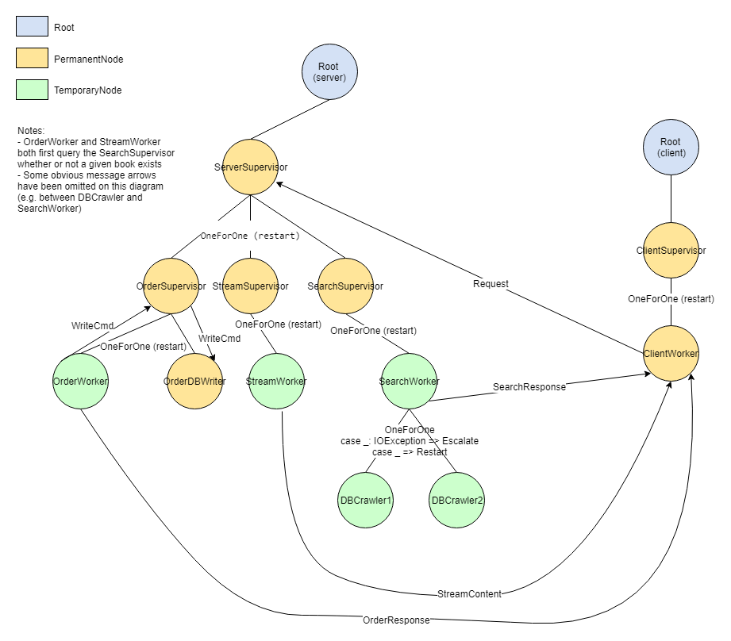

# Bookstore System
Bookstore System project for Distributed Systems class at AGH-UST (Scala+Akka)

## Schema

## Usage
Run the server and then the client:
* `client> search war_and_peace` - searching both DBs for a given book
* `client> order pride_and_prejudice` - ordering a book (order goes to `orders.txt`)
* `client> stream the_adventures_of_dr_thorndyke` - stream the book content line by line